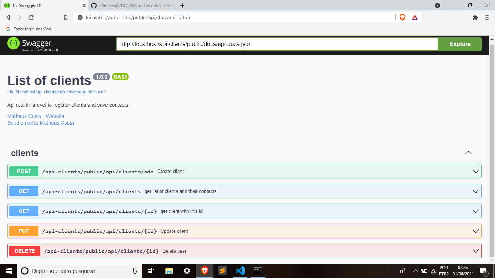

Rest API for clients registration and saving contacts:
PHP 8.0.5
Laravel Framework 8.42.1
Database: MySql(phpMyAdmin)

Modify the .env file to store the data in the database (based on the template file that is already in the repository),
also run the "composer install" to download the dependencies and "php artisan key: generate", to generate the encryption key.

Testing requests using Curl in cmd.
Where id is written replace it with the id you want.

Swagger documentation
http://localhost/api-clients/public/api/documentation

GET 
curl "http://localhost/api-clients/public/api/clients"

POST
curl -X POST -H "Content-type: application/json" -d "{\"name\": \".......\", \"phone\": \"....\", \"email\": \"......\"}" "http://localhost/api-clients/public/api/clients/add"

SELECT
curl "http://localhost/api-clients/public/api/clients/{id}"

PUT
curl -X PUT -H "Content-type: application/json" -d "{\"name\": \".......\", \"phone\": \".....\", \"email\": \".......\"}" "http://localhost/api-clients/public/api/clients/{id}"

DELETE
curl -X DELETE "http://localhost/api-clients/public/api/clients/{id}"

